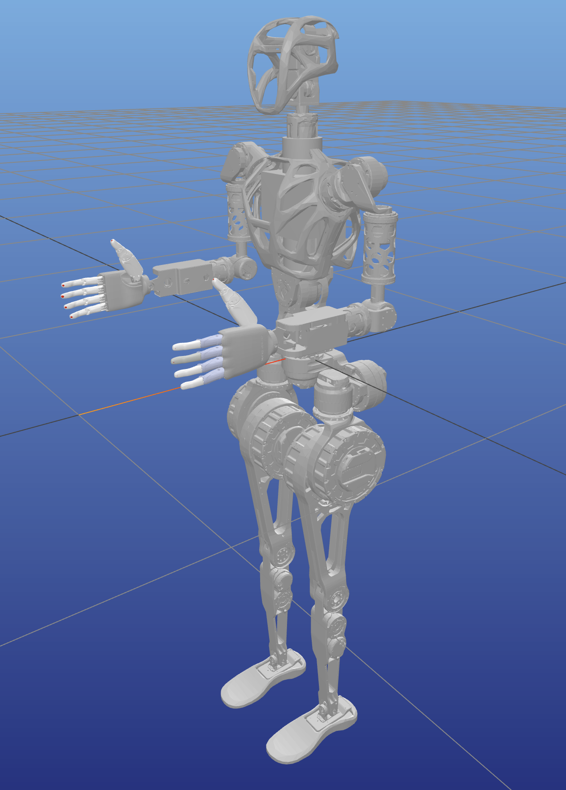

# GR1 Retarget

## Installation

```
cd GR1_retarget
conda create -n avp-teleop python=3.10
conda activate avp-teleop
pip install -r requirements.txt
pip install -e .
```

## Retarget from Apple Vision Pro

Install [Tracking Streamer](https://apps.apple.com/us/app/tracking-streamer/id6478969032) on your Apple Vision Pro.

### Real-time teleop

1. Open Tracking Streamer and click start, remember the IP address showing on the screen.

2. Human operator stand in [start pose](#start-pose)

3. Run `python scripts/vis_avp_stream.py --ip AVP_IP_ADDRESS`

### Record data

1. Open Tracking Streamer and click start, remember the IP address showing on the screen.

2. Human operator stand in start pose

3. Run `python scripts/record_avp_data.py --ip AVP_IP_ADDRESS --num NUMBER_OF_DATAPOINTS --freq FREQUENCY_OF_RECORDING`

### Replay record data

1. Run `python scripts/vis_avp_record.py --input data/eg_clean_data.pkl`

### Start pose


